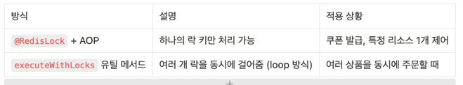

# Chapter. 3-1 대용량 트래픽&데이터 처리

-----------------------------------------------------------------------------------------------------------------

### STEP11 - Distributed Lock

- Redis 기반의 분산락을 직접 구현해보고 동작에 대한 통합테스트 작성
- 주문/예약/결제 기능 등에 적절한 키 적절한 범위를 선정해 분산락을 적용

Redis lock구성

redis lock pub/sub 적용을 위한 RedisLockAspect 기능 개발 -> url : 
[redisLockAop](
https://github.com/seokyeong-han/hh-repo/blob/5week/5week/e-commerce/src/main/java/com/example/ecommerce/global/aop/RedisLockAspect.java)

1. 주문 Redis Lock 구성
  
주문 동시성 test url -> https://github.com/seokyeong-han/hh-repo/blob/5week/5week/e-commerce/src/test/java/com/example/ecommerce/integration/OrderIntergrationTest.java

여러 상품을 동시에 주문 처리 시 productId에 관하여 락을 여러게 걸어야 한다.

    ex) productId: 1 → lock:product:1  
        productId: 2 → lock:product:2  
        productId: 3 → lock:product:3

orderFacade 주문
    
    List<String> keys = request.getItems().stream()
    .map(item -> "lock:product:" + item.getProductId())
    .distinct()
    .toList();

    redisLockAspect.executeWithLocks(keys, () -> {
    // 2~3번 수행
    });

    Redis 분산 락 처리 흐름 정리
    상품별 Redis 락을 미리 모두 획득한 후 주문 로직을 실행

    동일한 상품을 여러 유저가 동시에 주문할 경우:
    먼저 락을 획득한 유저만 주문 처리 진행
    이후 유저는 락 획득에 실패하거나 대기

    Deadlock 방지를 위한 정렬
    ex)
    유저 A: lock:product:1 → lock:product:2
    유저 B: lock:product:2 → lock:product:1

    위처럼 서로 다른 순서로 락을 획득하면 교착상태 발생 가능
    → 모든 스레드가 동일한 순서로 정렬된 락을 획득하도록 구현해야 함

    ✅ 장점
    동일 상품 중복 재고 차감 방지
    서비스 계층에서는 여전히 비관적 락 + 트랜잭션만으로 로직 유지
    도메인 정합성 보장 + 외부 락 처리 일관성 확보

2. 쿠폰 발급 Redis Lock 구성 

쿠폰 발급 동시성 테스트 url -> https://github.com/seokyeong-han/hh-repo/blob/5week/5week/e-commerce/src/test/java/com/example/ecommerce/integration/CouponIssueIntegrationTest.java

    orderService Redis 락 선점 (AOP)

    @RedisLock(
    key = "'lock:coupon:' + #couponId",
    waitTime = 5,
    leaseTime = 1,
    timeUnit = TimeUnit.SECONDS
    )
    
    @Transactional
    public void assignCouponToUser(Long couponId, Long userId) {

    동일 쿠폰에 다수 유저가 동시에 요청해도 1명만 락 선점 가능
    .map(item -> "lock:product:" + item.getProductId())

3. 유저 포인트 충전 Redis Lock 구성

유저 동시 포인트 충전 동시성 테스트 url -> https://github.com/seokyeong-han/hh-repo/blob/5week/5week/e-commerce/src/test/java/com/example/ecommerce/redis/pointChargeRedisTest.java

    
    @RedisLock(key = "'lock:user:' + #command.userId", leaseTime = 10, timeUnit = TimeUnit.SECONDS)
    @Retryable( //낙관적 락
      value = { OptimisticLockingFailureException.class },
      maxAttempts = 3, //실패시 재시도 횟수
      backoff = @Backoff(delay = 50) // ms 단위
    )
    @Transactional
    public void chargePoint (PointCommand command) {
        User user = userRepository.findById(command.getUserId())
                .orElseThrow(() -> new RuntimeException("유저가 없습니다."));
        //충전
        user.charge(command.getAmount());
        //유저 저장
        User chargUser = userRepository.save(user);
        //포인트 충전 히스토리 저장
        PointHistory pointHistory = PointHistory.charge(chargUser.getId(), command.getAmount(), chargUser.getBalance());
        pointHistoryRepository.save(pointHistory);
    }
    
    Redis 분산 락으로 사용자 단위 동시성 제어
    동일 유저 ID에 대해 동시에 충전 요청이 들어오는 경우 먼저 락을 잡은 쓰레드만 수행
    leaseTime이 지나면 락 자동 해제

    JPA의 @Version 기반 낙관적 락 충돌 발생 시 재시도
    유저 조회 후 도메인 메서드로 충전 (charge)
    변경된 유저 저장 (JPA의 dirty checking)
		
    ✅ 장점
    동시 요청 차단 (멀티 인스턴스 환경에서 중복 방지)
    성능은 유지하면서 정합성 확보 (동시 업데이트 대응)
