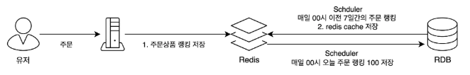
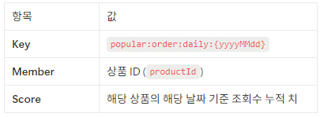

# Chapter. 3-2 대용량 트래픽&데이터 처리

-----------------------------------------------------------------------------------------------------------------

### STEP 13 Ranking Design

    이커머스 시나리오    
    가장 많이 주문한 상품 랭킹을 Redis 기반으로 개발하고 설계 및 구현

-----------------------------------------------------------------------------------------------------------------
### 인기 주문 상품 랭킹 Redis 구성

#### 1.orderService에서 주문 진행 후 after-commit event 주문 수 증가
    
    orderService
    //주문 증가 이벤트 발행
            List<Long> productIds = prepared.getOrderItems().stream()
                    .map(OrderItem::getProductId)
                    .toList();
            eventPublisher.publishEvent(new OrderPlacedEvent(productIds));

    after-commit event
    @TransactionalEventListener(phase = TransactionPhase.AFTER_COMMIT)
    public void handleOrderPlaced(OrderPlacedEvent event) {
        for (Long productId : event.getProductIds()) {
                rankingService.recordView(productId);
        }
    }

#### 2.일간 주문상품 랭킹 (Redis Sorted Set)

- key:`popular:order:daily:{yyyyMMdd}`

- value:Redis Sorted Set (ZSet)

- 각 요소: `productId` → 조회수 (score)

    //RankingService 실시간 주문 랭킹 증가
    public void recordView(Long productId) {
        String key = dailyKey(LocalDate.now());
        redisTemplate.opsForZSet().incrementScore(key, productId.toString(), 1);
    
        redisTemplate.expire(key, Duration.ofDays(8));
    }

    Redis key
    Key: popular:order:daily:20250514
    Sorted Set:
    - member: "42", score: 3
    - member: "17", score: 2
    - member: "8",  score: 1

    조회수 증가
    ZINCRBY popular:order:daily:20250514 1 "42"
    ttl 설정
    EXPIRE popular:order:daily:20250514 2592000

#### 3.주간 주문 상품 랭킹 (Redis Sorted Set)

 - key:`popular:order:weekly`
 - value:Redis Sorted Set (ZSet)
   - 각 요소: `productId` → 조회수 (score)
     

    
    주간 add redis
    ZADD popular:order:weekly 21 "1"
    ZADD popular:order:weekly 14 "2"
    ZADD popular:order:weekly 7 "3"

매일 Redis에 저장된 popular:order:daily:{yyyyMMdd} top100값 RDB에 저장 후

    public void persistDailyRanking(LocalDate date) {
    LocalDate today = LocalDate.now();//일별 랭킹 db insert
    String key = dailyKey(date);
    Set<ZSetOperations.TypedTuple<String>> top = redisTemplate.opsForZSet()
    .reverseRangeWithScores(key, 0, 99);

        if (top == null) return;

        List<DailyRanking> rankings = new ArrayList<>();
        int rank = 1;

        for (ZSetOperations.TypedTuple<String> tuple : top) {
            Long productId = Long.valueOf(tuple.getValue());
            int score = tuple.getScore().intValue();
            rankings.add(new DailyRanking(today, productId, rank++, score));
        }

        rankingRepository.saveDaily(date, rankings);
    }

매일 지난 7일간 주간 상품 Redis cache 저장
    
    public void cacheWeeklyRanking() {
        //오늘을 기준으로 전날까지 7일간의 랭킹을 조회
        LocalDate today = LocalDate.now();
        LocalDate start = today.minusDays(7);
        LocalDate end = today.minusDays(1);

        //7일간 일간 랭킹 조회
        List<DailyRanking> last7days = rankingRepository.findBetweenDates(start, end);

        //점수 합산
        Map<Long, Integer> scoreMap = last7days.stream()
                .collect(Collectors.groupingBy(
                        DailyRanking::productId,
                        Collectors.summingInt(DailyRanking::score)
                ));

        // Redis 키 생성 및 초기화
        String weeklyKey = "popular:order:weekly";
        redisTemplate.delete(weeklyKey);

        // Redis용 ZSet 데이터 생성
        Set<ZSetOperations.TypedTuple<String>> tuples = scoreMap.entrySet().stream()
                .map(e -> new DefaultTypedTuple<>(e.getKey().toString(), (double) e.getValue()))
                .collect(Collectors.toSet());

        redisTemplate.opsForZSet().add(weeklyKey, tuples); //Redis에 ZADD 명령으로 저장
        redisTemplate.expire(weeklyKey, Duration.ofDays(2));
    }
