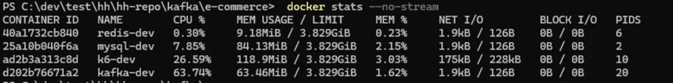

## Chapter. 4 장애대응

### **`STEP 19`**

- 부하 테스트 대상 선정 및 목적, 시나리오 등의 계획을 세우고 이를 문서로 작성
- 적합한 테스트 스크립트를 작성하고 수행

> `NiceToHave` Docker 의 실행 옵션 (cpu, memory) 등을 조정하면서 애플리케이션을 실행하여 성능 테스트를 진행해보면서 적절한 배포 스펙 고려도 한번 진행해보세요!

---


### 부하 테스트
 - **부하 테스트란**
시스템이 실제 운영 환경에서 예상되는 부하를 처리할 수 있는지 확인하는 성능 테스트 유형**입니다. 여러 사용자가 동시에 시스템에 접근하는 것을 시뮬레이션하여 시스템의 성능 한계, 병목 지점, 성능 저하 요인을 파악하고 개선하는 데 사용됩니다.


### 부하 테스트 목표

- **시스템 성능 측정 :** 요청 처리 속도, 처리량(Throughput), 응답 시간 등을 측정

- **병목 지점 파악  :** DB, 캐시, API 등 병목이 발생하는 부분을 식별

- **시스템 안정성 확인 :** 트래픽이 몰려도 시스템이 다운되지 않는지 확인

- **확장 필요성 검토 :** 서버 증설, 캐시 도입 등의 필요성을 판단


### 부하 테스트 종류

- **Load Test (부하 테스트)            :** 일반적인 사용자가 몰리는 수준을 시뮬레이션 ex) 초당 100명 로그인

- **Stress Test (스트레스 테스트)  :** 한계를 넘는 부하를 줘서 시스템이 언제 망가지는지 확인

- **Spike Test (급증 테스트)           :** 갑작스러운 트래픽 증가에 시스템이 어떻게 반응하는지 측정

- **Soak Test (지속 테스트)            :** 수 시간 ~ 수 일 동안 일정 부하를 주고, 메모리 누수나 성능 저하 있는지 확인


### 부하 테스트 도구

**K6**
- 개발 언어 : JavaScript
- Go 기반. 스크립트 작성 쉬움. CI/CD와 통합 쉬움
- Grafana, InfluxDB 연동으로 실시간 모니터링 가능

**JMeter**
- 개발 언어 : Java (XML 기반 GUI)
- GUI 지원. 복잡한 시나리오 작성 가능
- 고성능 테스트 시 JVM 튜닝 필요, 분산 테스트 구성 복잡

**nGrinder**
- 개발 언어 : Groovy (JVM 기반)
- Agent 설치로 분산 부하 테스트 가능 (수천 VUser까지 가능)
- Groovy로 강력한 테스트 작성 가능
- 자체 서버 구축 필요 (Controller + Agent)
- 
-----------------------------------------------------------------------------------------------------------------

## 🔍 부하 테스트 보고서

### 시스템 흐름 요약

- **상품 조회** `/api/products` 요청 시 `ProductFacade → ProductService`를 통해 DB 조회
- **인기 상품 조회** `/api/popularProduct/today` 요청 시 Redis ZSET에서 인기 상품 ID + 조회수 반환
- **주문 요청** `/api/orders` 요청 시 Kafka `order.start` 토픽에 메시지 발행
- **주문 처리** 재고 차감 및 주문 생성은 Kafka Consumer가 비동기 처리

###  테스트 대상 API

| Endpoint | 설명 |
| --- | --- |
| `GET /api/products` | 전체 상품 목록 조회 API |
| `GET/api/popularProduct/today` | 인기 상품 목록 조회 API |
| `POST/api/orders` | 사용자 주문 생성 API(비동기) |
---
## 테스트 시나리오

### 시나리오 1: 스파이크 테스트 (Spike Test)

- 목적: 짧은 시간에 급격히 부하가 몰릴 경우 시스템이 버티는지 확인
- 부하 패턴:

    ```json
    [
      { "duration": "2s", "target": 0 },     // 유휴 상태
      { "duration": "1s", "target": 500 },   // 급증
      { "duration": "10s", "target": 200 },  // 유지
      { "duration": "5s", "target": 0 }      // 감소
    ]
    ```

- 예상 요청: 약 10000회 이상


### 시나리오 2: 피크 테스트 (Peak Load Test)

- 목적: 지정된 **최대 사용자 수**에서의 처리 성능 측정
- 설정: 100 VUs, 10초 동안 지속
- 목표: `1000회 이상` 처리 가능 여부, 오류율 0% 유지
- 평균 응답 시간: **1초 이내**

### 테스트 환경

| 항목 | 값 |
| --- | --- |
| 테스트 도구 | [K6](https://k6.io/) |
| 실행 환경 | Docker + k6 container |
| 대상 서버 | 개발 서버 (e.g., `http://host.docker.internal:8080`) |
| DB | MySQL (동시성 테스트 대비 index 및 transaction 설정 점검 필요) |
| Kafka | 주문 성공 시 메시지 발행 여부는 현재 제외(추후 측정 가능) |

###  수집 항목

| 항목 | 설명 |
| --- | --- |
| 요청 성공률 (200 OK) | 전체 요청 중 성공 비율 |
| 응답 시간 | 평균, p95, 최대 응답 시간(ms) |
| 실패율 | 500, 400 오류 등 발생 비율 |
| 처리 TPS | 초당 처리 가능한 트랜잭션 수 |
| 시스템 리소스 | (선택) CPU, Memory, DB 커넥션 수 등 별도 측정 가능 |

### 테스트 결과 요약

K6 테스트 log : https://github.com/seokyeong-han/hh-repo/blob/step19/kafka/e-commerce/docs/load-test.log

pc성능 : 일반 개인 컴퓨터 i5, 16GB

| 항목 | 값 |
| --- | --- |
| 전체 요청 수(`http_reqs`) | `13,311` |
| 평균 응답 시간(`avg`) | `4.78ms` |
| 95% 응답 시간 (`p95`) | `9.39ms` |
| 실패율(`http_req_failed`) | `0.00%`  |
| 전체 반복 횟수(`iterations`) | `4,437` (유저당 1세트 (조회 + 주문) 기준) |
| 최고 동시 VU(`vus_max`) | `500` (테스트 중 동시에 활동한 최대 사용자 수) |
| 초당 처리 요청 수 (TPS) | 약 723 TPS – 초당 약 723건 요청 처리 (18.4초 기준) |

---

### 성능 제한 테스트

**Docker 성능 제한 방법**

C:\Users\hanseok 경로에 전체 파일로 생성 해야 함 (공백 포함 주의)

.wslconfig
```jsx
[wsl2]
memory=4GB          # Docker WSL에 할당할 최대 메모리
processors=2        # 사용할 CPU 코어 수
swap=2GB            # 스왑 공간 (선택 사항)
```


**부하 패턴**
```jsx
export let options = {
    stages: [
        { duration: '2s', target: 0 },    // 준비
        { duration: '1s', target: 1000 },  // 급증
        { duration: '10s', target: 300 }, // 유지
        { duration: '5s', target: 0 },    // 감소
    ]
};
```
K6 테스트 log : https://github.com/seokyeong-han/hh-repo/blob/step19/kafka/e-commerce/docs/load-test-throttled.log

### 테스트 결과 요약

| 항목 | 측정 결과 |
| --- | --- |
| **총 요청 수 (`http_reqs`)** |  **19,443건** (상품 조회 + 인기 상품 조회 + 주문 요청 포함) |
| **성공한 요청 비율** |  **100%** (19,443 / 19,443) |
| **에러 요청 수 (`http_req_failed`)** |  **0건** – 실패 없음 |
| **평균 응답 시간 (`avg`)** | ⏱️ **80.14ms** |
| **최대 응답 시간 (`max`)** | ⏱️ **799.9ms** |
| **p90 응답 시간** | ⏱️ **223.31ms** – 90%가 이내 처리됨 |
| **p95 응답 시간** | ⏱️ **333.44ms** – 95%가 이내 처리됨 |
| **평균 반복 시간 (`iteration_duration`)** |  **1.27초** |
| **총 반복 횟수 (`iterations`)** | **6,481회** – 한 세트 = 상품 조회 + 인기 상품 조회 + 주문 |
| **최대 가상 사용자 수 (`vus_max`)** | 👥 **1000명** |
| **초당 처리 요청 수 (TPS)** |  약 **1023 TPS** |
| **네트워크 트래픽** | ⬆️ **2.6MB 전송**, ⬇️ **6.1MB 수신** |


